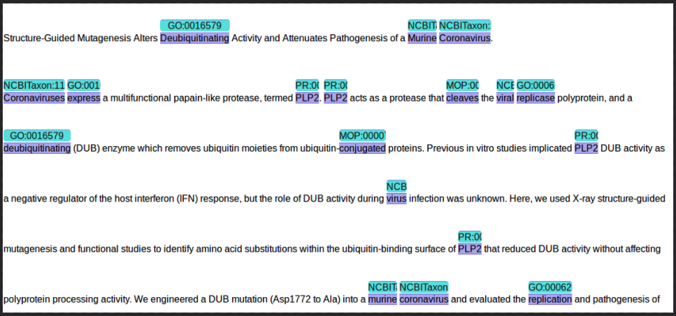

## BLAH7 project description

The goal of this project is to enable the analysis of COVID-19 related scientific literature by enriching it with domain specific entities.
We have automatically processed the entire [LitCovid](https://www.ncbi.nlm.nih.gov/research/coronavirus/) corpus with our [OGER](https://nlp.idsia.ch/TOOLS/OGER/) pipeline.

Our terminologies are derived from the major life science databases using our [Bio Term Hub](https://pub.cl.uzh.ch/projects/ontogene/biotermhub/), which allows us to maintain up-to-date dictionaries synchronized with the original resources.

Our current annotation pipeline generates annotations for several entity types:

- cell lines
- clinical drugs (RxNorm)
- cells
- molecular processes
- sequences
- organ/tissue
- chemicals
- Gene Ontology (GO)
- organisms
- proteins

More specifically, we have processed two corpora derivered from LitCovid:

- [The LitCovid abstracts](https://covid19.nlp.idsia.ch/litcovid-oger-bb.html) (same as provided by LitCovid)
- [The LitCovid full texts](https://covid19.nlp.idsia.ch/litcovidPMC-oger-bb.html) (the full text papers of LitCovid abtracts, for the papers where the full text is contained in PubMed Central)

## Team Members
- Nico Colic
- Joseph Cornelius
- Oscar Lithgow
- Fabio Rinaldi

