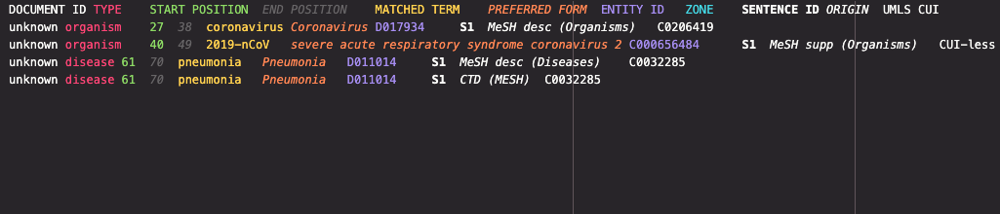

**Table of content:**

- [BLAH7 project description](#blah7-project-description)
- [Tasks](#tasks)
  - [Subtask 1: Application of OGER to novel papers](#subtask-1-application-of-oger-to-novel-papers)
    - [Introduction to OGER](#introduction-to-oger)
    - [1. Check dictionary availability](#1-check-dictionary-availability)
    - [2. Request the annotation](#2-request-the-annotation)
  - [Subtask 2: Find evidence in support or against specific drugs for the treatment of COVID-19](#subtask-2-find-evidence-in-support-or-against-specific-drugs-for-the-treatment-of-covid-19)
  - [Subtask 3: Document classification](#subtask-3-document-classification)
    - [Aim](#aim)
    - [Classification scheme:](#classification-scheme)
      - [Clinical specialities](#clinical-specialities)
      - [Types](#types)
      - [Topics-and-SubTopics](#topics-and-subtopics)
      - [Subtopics](#subtopics)
    - [About the data](#about-the-data)
      - [Data provided for each document](#data-provided-for-each-document)
      - [Number of documents for each class](#number-of-documents-for-each-class)
- [Team Members](#team-members)

## BLAH7 project description

The goal of this project is to enable the analysis of COVID-19 related scientific literature by enriching it with domain specific entities.
We have automatically processed the entire [LitCovid](https://www.ncbi.nlm.nih.gov/research/coronavirus/) corpus with our [OGER](https://nlp.idsia.ch/TOOLS/OGER/) pipeline.

Our terminologies are derived from the major life science databases using our [Bio Term Hub](https://pub.cl.uzh.ch/projects/ontogene/biotermhub/), which allows us to maintain up-to-date dictionaries synchronized with the original resources.

Our current annotation pipeline generates annotations for several entity types:

- cell lines
- clinical drugs (RxNorm)
- cells
- molecular processes
- sequences
- organ/tissue
- chemicals
- Gene Ontology (GO)
- organisms
- proteins

More specifically, we have processed two corpora derivered from LitCovid:

- [The LitCovid abstracts](https://covid19.nlp.idsia.ch/litcovid-oger-bb.html) (same as provided by LitCovid)
- [The LitCovid full texts](https://covid19.nlp.idsia.ch/litcovidPMC-oger-bb.html) (the full text papers of LitCovid abtracts, for the papers where the full text is contained in PubMed Central)


## Tasks

- use OGER to process new papers
- use the annotations to find evidence in support of drugs for the treatment of COVID-19
- classification clinical repository CCG/UNAM. Do the entities help improve classification?

### Subtask 1: Application of OGER to novel papers

In the first subtask, we plan to use OntoGene's Biomedical Entity Recogniser (OGER) to annotate novel papers. For this purpose we will use OGER's for COVID-19 dedicated API, which will allow us to obtain COVID-19 specific information in the second subtask.

#### Introduction to OGER
OGER is a fast, accurate entity annotation tool, which is accessible either as a software package, or as a web service. Given text as input, it delivers annotations as output, as illustrated in the picture below.

The dictionaries used for annotation are obtained from major life science databases (cellosaurus, cell ontology, ChEBI, CTD, EntrezGene, Gene Ontology, MeSH, Molecular Process Ontology, NCBI Taxonomy, Protein Ontology, RxNorm, Sequence Ontology, Swiss-Prot, Uberon).

OGER dictionaries are sourced and kept synchronized with the original databases through usage of our own Bio Term Hub.

OGER APIs are Web service APIs (type REST) that allows easy access to online OGER annotation capabilities.

The APIs’ information

Base URL: https://pub.cl.uzh.ch/projects/ontogene/oger/

Below there is a minimal example to perform an online annotation. (And you can find a more detailed example [here](https://covid19.nlp.idsia.ch/oger-rest.html).)

#### 1. Check dictionary availability
In this example we are using the default dictionary. This dictionary is already available and its hexacode is 509f822aaf527390.

To check status and description by running:

```sh
curl --location --request GET 'https://pub.cl.uzh.ch/projects/ontogene/oger/dict/509f822aaf527390/status'
```

Which would respond something similar to:
```json
{
    "status": "ready",
    "description": "default"
}
```

So, we are ready to go.


#### 2. Request the annotation

We can request the annotation of local data by doing a POST to the /upload endpoint and passing the route parameters that specify the input and output format.

Below there is an example of the request. In this example the uploaded data is raw text (txt), the requested output format is a tabular table (tsv) and the text to be annotated is passed in the POST payload.

```sh
curl --location \
--request POST 'https://pub.cl.uzh.ch/projects/ontogene/oger/upload/txt/tsv?dict=509f822aaf527390' \
--header 'Content-Type: text/plain' \
--data-raw 'The initial cases of novel coronavirus (2019-nCoV)-infected 
pneumonia (NCIP) occurred in Wuhan, Hubei Province, China, in December 2019 
and January 2020.
We analyzed data on the first 425 confirmed cases in Wuhan to
determine the epidemiologic characteristics of NCIP.We collected
information on demographic characteristics, exposure history, and
illness timelines of laboratory-confirmed cases of NCIP that had been
reported by January 22, 2020.'
```

Which should yield this response:   


----------------

### Subtask 2: Find evidence in support or against specific drugs for the treatment of COVID-19

The goal of this subtask is to **find evidence in support or against specific drugs for the treatment of COVID-19**
within the OGER-annotated LitCovid dataset (both the abstract dataset and the full text dataset can be used).

The following drugs in particular will be considered: [hydroxychloroquine](https://en.wikipedia.org/wiki/Hydroxychloroquine), [remdesivir](https://en.wikipedia.org/wiki/Remdesivir), [avigan](https://en.wikipedia.org/wiki/Favipiravir).

Examples of statements in support/against the clinical usage of Hydroxychloroquine for the treatment of COVID-19:

[32150618](https://pubmed.ncbi.nlm.nih.gov/32150618/): *Hydroxychloroquine was found to be more potent than chloroquine to inhibit SARS-CoV-2 in vitro.*

[32205204](https://pubmed.ncbi.nlm.nih.gov/32205204/): *Chloroquine and hydroxychloroquine have been found to be efficient on SARS-CoV-2, and reported to be efficient in Chinese COV-19 patients.*
*Despite its small sample size our survey shows that hydroxychloroquine treatment is significantly associated with viral load reduction/disappearance in COVID-19 patients and its effect is reinforced by azithromycin.*

[32240719](https://pubmed.ncbi.nlm.nih.gov/32240719/): *No evidence of rapid antiviral clearance or clinical benefit with the combination of hydroxychloroquine and azithromycin in patients with severe COVID-19 infection.*


### Subtask 3: Document classification

The medical literature relevant to Coronavirus disease 2019 (COVID-19) is growing exponentially. Doctors, Clinicians, and health workers in general need tools monitoring and prioritizing the literature to make the most of their time by allowing them to focus on the literature more relevant to their endeavors. 

Text classification is one of the predominant tasks in Natural Language Processing. It has many applications, including fake news detection, sentiment analysis, among others. For the current pandemic, an immediate application is to categorize COVID-19 related documents in different medical specialty areas to respond to the need for updated information on priority topics.

#### Aim


This assignment aims to classify COVID-19 literature following a 3-way classification scheme developed considering the [PRECEPT scheme](https://pubmed.ncbi.nlm.nih.gov/29019317/). The documents should be classified in 3 independent dimensions: clinical specialties, types, topics-and-subtopics. The later is a two-level classification.

**As for the majority of real-life problems the training dataset will be small --considering that for some classes there will be very few examples-- so the challenge is how to better leverage the title and abstract texts and the Named Entities identified by OGER.**


#### Classification scheme:


##### Clinical specialities

There are 29 clinical specialties represented in the dataset: Cardiology, Surgery, Cardiovascular Surgery, Dermatology, Endocrinology, Physiotherapy, Gastroenterology, Hematology, Hepatobiliary Digestive, Infectology, Immunology, Internal Medicine, Nephrology, Pulmonology, Neurology, Obstetrics, Dentistry, Ophthalmology, Oncology, Otolaryngology, Radiology, Pathology, Pediatrics , Rehabilitation, Rheumatology, Transplantation, ICU Anesthesia, Virology, Molecular Biology.

##### Types


1. **Intervention studies:** An intervention study is one in which some type of intervention is carried out on the participants (for example, the administration of a drug), in order to evaluate it. This category includes randomized controlled clinical trials, non-randomized controlled studies.
    
2. **Observational studies:** Observational studies correspond to research designs which their objective is "the observation and recording" of events without intervening in their natural course. Measurements can be made over time (longitudinal study), either prospectively or retrospectively; or uniquely (cross-sectional study).
    
3. **Narrative reviews:**  The compilation of the bibliography on a given topic
    
4. **Systematic reviews:** A systematic review aims to gather all the empirical evidence that meets previously established eligibility criteria, in order to answer a specific research question. It uses systematic and explicit methods, which are chosen in order to minimize biases, thus providing more reliable results from which conclusions can be drawn and decisions can be taken (Antman 1992, Oxman 1993).
    
5. **Clinical Practice Guides:** The clinical practice guides provide recommendations on the benefits and disadvantages of different interventions available in healthcare.
    
6. **Others:** Documents that could not be classified in any of the previous categories
    
##### Topics-and-SubTopics

The topics category was created according to the classification of the "[living evidence map on COVID-19](https://www.fhi.no/contentassets/e64790be5d3b4c4abe1f1be25fc862ce/covid-19-evidence-map-protocol-20200403.pdf)":

1. **Diagnosis:** Documents related to the COVID-19 screening tests based on PCR and RT-PCR, serological tests, clinical diagnosis (by medical history, imaging, blood tests).
2. **Prognosis:** Documents that determine the prognosis of COVID-19 disease by clinical or laboratory criteria. As well as, studies that determine the case fatality rate, complications or disability.
       
3. **Epidemiology:** Documents related to the incidence and prevalence of COVID-19 disease.
       
4. **Etiology:** Documents or articles related to: the characteristics of SARS-CoV-2 (the origin or history of SARS-CoV-2, analysis of the sequences, subtypes, serotypes of SARS-CoV-2, pathogenicity and virulence, reservoirs); modes of transmission (animal to person, person to person, aerosols, blood, feces, surfaces); pathophysiology (incubation period, SARS-CoV-2 immune response)
       
5. **Experiences, perceptions, conceptions:** Documents related to perceptions, reliability, barriers and facilitators, political aspects, economic aspects, ethical aspects, collateral consequences, social media, equity.
       
6. **Clinical overview:** Documents of cohorts that describe clinical characteristics.
       
7. **Interventions:** Documents of interventions that aim to manage the pandemic: strategies for behavior modification, case identification, follow-up contacts, communication strategies, disinfection of public spaces, warehouses and offices, information systems geographic, planning to increase ICU beds, triage, staff planning.
       
8. **Modeling:**

9. **Prevention and control:** Documents related to quarantine, restrictions on the movement of citizens, isolation, restrictions on schools, kindergartens, work from home, restrictions on business activities and events, travel restrictions, physical barriers (masks, gloves, others), hand washing, hand disinfection, vaccines.
       
10. **Health services:** Documents related to the investigation of health services.

##### Subtopics

As for the subtopics, there are 27 different categories such as: Isolation, Antivirals, Biologicals, Prisons, Chloroquine and Hydroxychloroquine, Corticosteroids, Disinfection, Clinical Diagnosis, Therapeutic Targets, Treatment Clinical Trials, Personal Protective Equipment, Images, Drug Interactions, Ivermectin, General Prevention Measures, Plasma, Serological Tests , Molecular Detection Tests, School and University Restrictions, Travel Restrictions, Citizen Circulation Restrictions, Evidence Summaries, Vital and Ventilatory Support, Alternative Therapies, Vaccine, Public Road, Others.


#### About the data

The collection of documents to be classified is part of a [repository](https://covid19.ccg.unam.mx/repoinfo.html) created by an [interdisciplinary cooperation group](https://covid19.ccg.unam.mx/index.html). The sources of information were medical databases, government and institutional websites.

Contrasting with the [LitCovid](https://www.ncbi.nlm.nih.gov/research/coronavirus/) dataset and the COVID-19 Open Research Dataset ([CORD19](https://allenai.org/data/cord-19)),  the dataset here presented is not limited to scientific articles but it also includes other types of documents relevant to the health workers, e.g., *Clinical practice guides*.

##### Data provided for each document

* Title
* Abstract

##### Number of documents for each class

|Speciality|Docs.|
|--|--|
|Cardiology|9|
|Surgery|6|
|Cardiovascular Surgery|8|
|Dermatology|5|
|Endocrinology|8|
|Physiotherapy|2|
|Gastroenterology|12|
|Hematology|5|
|Digestive Hepatobiliary|5|
|Infectology|7|
|Immunology|4|
|Internal Medicine|6|
|Nephrology|7|
|Pneumology|19|
|Neurology|5|
|Obstetrics|11|
|Odontology|2|
|Ophthalmology|5|
|Oncology|18|
|Otorhinolaryngology|3|
|Pathology|2|
|Pediatrics|24|
|Psychiatry|14|
|Radiology|24|
|Rehabilitation|2|
|Rheumatology|3|
|Transplant|3|
|ICU Anesthesia|20|
|Virology, Molecular Biology|42|


|Types|Docs.|
|--|--|
|Observational Studies|56|
|Intervention Studies|2|
|Clinical Practice Guidelines|10|
|Others|164|
|Narrative Reviews|31|
|Systematic Reviews|9|


|Topics|Docs.|
|--|--|
|Diagnosis|25|
|Epidemiology|109|
|Experiences Perceptions Consequences|18|
|Clinical Overview|48|
|Interventions|3|
|Predictive Clinical Models|25|
|Prevention and Control|57|
|Personal Health Support Students and Society|31|
|Telemedicine|3|
|Transmission|1|
|Treatment|79|


|SubTopics|Docs.|
|--|--|
|Isolation|2|
|Antivirals|9|
|Biological|7|
|Jails|1|
|Chloroquine and Hydroxychloroquine|8|
|Corticosteroids|1|
|Disinfection|2|
|Clinical diagnosis|1|
|Therapeutic targets|4|
|Treatment Clinical Trials|3|
|Personal protection equipment|10|
|Images|1|
|Drug Interactions|3|
|Ivermectin|1|
|General Prevention Measures|15|
|Others|66|
|Plasma|5|
|Serological tests|3|
|Molecular Detection Tests|11|
|Colleges and Universities Restrictions|1|
|Travel restriction|1|
|Citizen Circulation Restriction|1|
|Evidence Summaries|4|
|Vital and Ventilatory Support|1|
|Alternative therapies|1|
|Vaccine|2|
|Public road|1|


----------------


## Team Members
- Nico Colic
- Joseph Cornelius
- Oscar Lithgow
- Fabio Rinaldi


